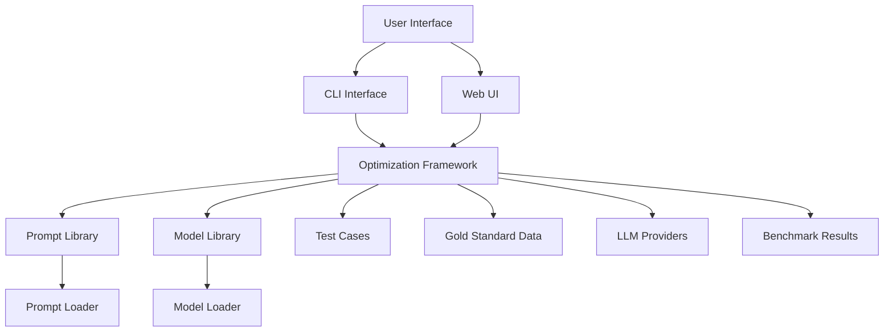
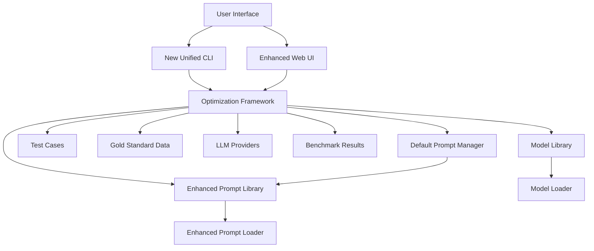
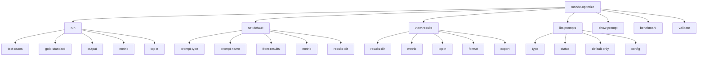

# MCODE Translator System Architecture

## Current Architecture



## Enhanced Architecture with Default Prompt Functionality



## CLI Command Structure



## Data Flow for Optimization Process

```mermaid
sequenceDiagram
    participant U as User
    participant C as CLI
    participant F as Optimization Framework
    participant P as Prompt Library
    participant M as Model Library
    participant T as Test Cases
    participant G as Gold Standard
    participant L as LLM Provider
    participant R as Results Storage

    U->>C: mcode-optimize run
    C->>F: Initialize optimization
    F->>P: Load prompts
    F->>M: Load models
    F->>T: Load test cases
    F->>G: Load gold standard
    loop For each prompt-model-test combination
        F->>L: Execute benchmark
        L-->>F: Return results
        F->>R: Save benchmark result
    end
    F->>F: Calculate metrics
    F->>F: Determine best combinations
    C->>C: Display results
    U->>C: mcode-optimize set-default
    C->>F: Get best combination
    F->>P: Update default prompt
    P->>P: Save configuration