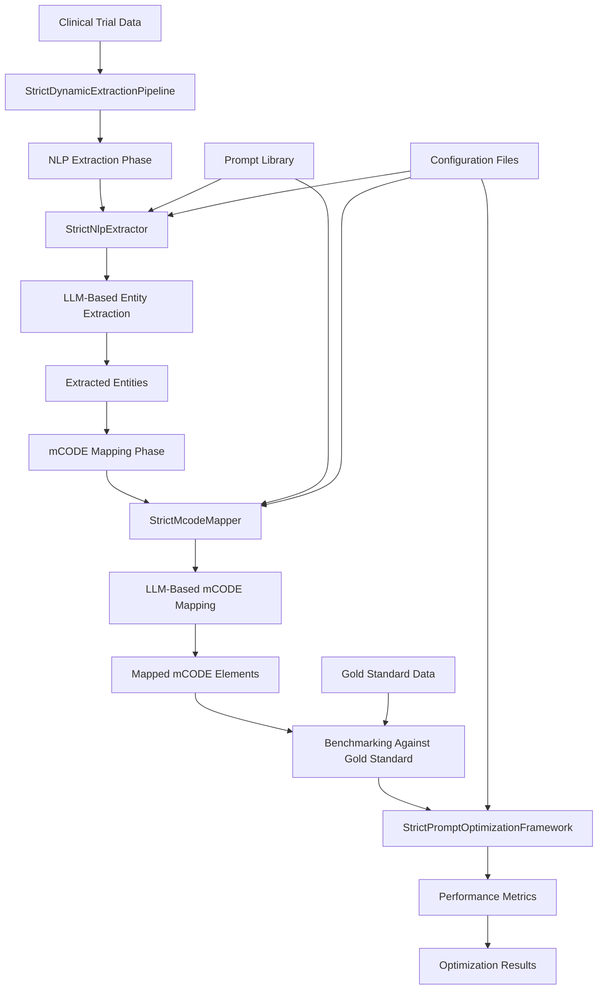

# STRICT Framework Documentation

## Overview

The STRICT (STRICT Requirements for Immediate Correction and Testing) framework is a robust infrastructure designed for lean, performant code without excessive fallbacks. It emphasizes raising exceptions to fix inaccessible assets in real-time without code bloat. This approach ensures that all components are properly configured and accessible, leading to more reliable and maintainable systems.

## Key Principles

1. **No Fallbacks**: The framework does not implement fallback mechanisms. If a component is not accessible or properly configured, it raises an exception immediately.
2. **Exception-Based Error Handling**: All errors are handled through exceptions, ensuring that issues are addressed immediately rather than being silently ignored or worked around.
3. **Accessible Assets**: All assets (configuration files, prompt templates, API keys, etc.) must be accessible and properly configured for the system to function.
4. **Real-Time Correction**: Issues are identified and must be corrected in real-time, preventing the accumulation of technical debt.
5. **Lean Code**: The framework avoids code bloat by not implementing unnecessary fallbacks or complex error recovery mechanisms.

## Data Flow Diagram



### Data Flow Description

1. **Input**: Clinical trial data is fed into the `StrictDynamicExtractionPipeline`.
2. **NLP Extraction**: The pipeline processes the data through the `StrictNlpExtractor`, which uses LLM-based entity extraction to identify medical entities.
3. **mCODE Mapping**: The extracted entities are then mapped to mCODE elements using the `StrictMcodeMapper`, which also uses LLM-based mapping.
4. **Benchmarking**: The results are benchmarked against gold standard data using the `StrictPromptOptimizationFramework` to generate performance metrics.
5. **Optimization**: The performance metrics are used to optimize the system, with results fed back into the prompt library and configuration files.

## Strict Interface Definitions

### NLP Extraction Interface

The NLP extraction phase expects the following data structure:

```json
{
  "protocolSection": {
    "identificationModule": {
      "nctId": "string",
      "briefTitle": "string"
    },
    "conditionsModule": {
      "conditions": ["string"]
    },
    "eligibilityModule": {
      "eligibilityCriteria": "string"
    },
    "armsInterventionsModule": {
      "interventions": [
        {
          "type": "string",
          "name": "string",
          "description": "string"
        }
      ]
    }
  }
}
```

### mCODE Mapping Interface

The mCODE mapping phase expects the following data structure for extracted entities:

```json
{
  "entities": [
    {
      "text": "string",
      "type": "string",
      "attributes": {
        "status": "string",
        "metastatic": "boolean"
      },
      "confidence": "number",
      "source_context": {
        "section": "string"
      }
    }
  ]
}
```

### Benchmarking Interface

The benchmarking phase expects the following data structure for gold standard data:

```json
{
  "gold_standard": {
    "condition_name": {
      "expected_extraction": {
        "entities": [
          {
            "text": "string",
            "type": "string",
            "attributes": {
              "status": "string"
            },
            "confidence": "number",
            "source_context": {
              "section": "string"
            }
          }
        ]
      },
      "expected_mcode_mappings": {
        "mapped_elements": [
          {
            "mcode_element": "string",
            "value": "string",
            "confidence": "number",
            "mapping_rationale": "string"
          }
        ]
      }
    }
  }
}
```

## Extending Benchmarking to Other Cancers or Oncologic Conditions

To extend the benchmarking framework to other cancers or oncologic conditions, follow these steps:

1. **Create Test Data**: 
   - Create a new clinical trial data file in `examples/[condition_name]/[condition_name].trial.json`
   - Create a corresponding gold standard file in `examples/[condition_name]/[condition_name].gold.json`

2. **Update Test Scripts**:
   - Modify `test_validation_optimization.py` to load the new test data
   - Add the new condition to the test cases

3. **Configure Prompts**:
   - Ensure the prompt library in `prompts/` has appropriate prompts for the new condition
   - Update `prompts/prompts_config.json` if new prompt templates are added

4. **Run Benchmarks**:
   - Execute the test script to run benchmarks for the new condition
   - Analyze the results to optimize performance

5. **Add to Automated Testing**:
   - Add the new condition to the automated test runners in `tests/`
   - Update the test configuration files as needed

### Example: Adding Lung Cancer Data

1. Create `examples/lung_cancer_data/lung_cancer.trial.json` with clinical trial data for lung cancer
2. Create `examples/lung_cancer_data/lung_cancer.gold.json` with expected extraction and mapping results
3. Update `test_validation_optimization.py` to load the lung cancer data:
   ```python
   def load_lung_cancer_data():
       """Load lung cancer test data from examples directory"""
       trial_file = "examples/lung_cancer_data/lung_cancer.trial.json"
       gold_file = "examples/lung_cancer_data/lung_cancer.gold.json"
       
       # Load test data
       with open(trial_file, 'r') as f:
           trial_data = json.load(f)
       
       with open(gold_file, 'r') as f:
           gold_standard = json.load(f)
       
       return trial_data, gold_standard
   ```
4. Add the lung cancer test case to the optimization framework:
   ```python
   # Load test case and gold standard data
   trial_data, gold_standard = load_lung_cancer_data()
   test_case = trial_data['test_cases']['lung_cancer']
   framework.add_test_case("lung_cancer_test", test_case)
   
   # Extract expected entities and mappings from gold standard
   expected_data = gold_standard['gold_standard']['lung_cancer']
   expected_entities = expected_data['expected_extraction']['entities']
   expected_mappings = expected_data['expected_mcode_mappings']['mapped_elements']
   ```
5. Run the benchmarks and analyze the results for lung cancer

## Configuration

The STRICT framework uses a unified configuration system defined in `config.json`. This file contains all the necessary configuration for the system, including:

- API configurations for LLM providers
- Cache settings
- Rate limiting parameters
- Request timeout settings
- Validation settings

All components of the system use this unified configuration, ensuring consistency and reducing the need for duplicate configuration values.

## Prompt Library

The system uses a file-based prompt library instead of hardcoded prompts. This allows for easier maintenance and updating of prompts without modifying the source code. The prompt library is defined in `prompts/prompts_config.json` and the actual prompt templates are stored in `prompts/txt/`.

## Caching

The system implements caching for LLM API calls using `functools.lru_cache` to improve performance and reduce API usage. This replaces the previous custom cache manager implementation:

- Maximum cache size: 128 entries
- Thread-safe implementation through LRU cache
- Automatic eviction of least recently used entries
- Proper token usage tracking even with cached responses

The caching mechanism has been simplified to use `functools.lru_cache` with a maximum size of 128 entries. This eliminates the need for a custom cache manager and reduces code complexity while maintaining the same functionality. The new implementation properly tracks token usage even when cached responses are used, which was a key requirement for accurate benchmarking.

The system implements caching for LLM API calls to improve performance and reduce API usage. The caching is configured through the unified configuration system and can be enabled or disabled as needed.

## Error Handling

All errors in the STRICT framework are handled through exceptions. This ensures that issues are immediately identified and addressed, rather than being silently ignored or worked around with fallback mechanisms. The framework provides detailed error messages to help developers quickly identify and fix issues.

## Performance Considerations

### Caching Mechanism

The system now implements caching for LLM API calls using `functools.lru_cache` instead of a custom cache manager. This simplifies the codebase and reduces dependencies while maintaining the same performance benefits:

- Maximum cache size: 128 entries
- Thread-safe implementation through LRU cache
- Automatic eviction of least recently used entries
- Elimination of custom cache manager code

This change reduces code complexity and improves maintainability while preserving the performance benefits of caching.

The STRICT framework is designed for performance with the following considerations:

1. **Minimal Fallbacks**: By not implementing fallback mechanisms, the system avoids the overhead of checking for and handling fallback conditions.
2. **Caching**: LLM API responses are cached to reduce API calls and improve response times.
3. **Strict Validation**: Early validation of configurations and inputs prevents runtime errors and ensures optimal performance.
4. **Lean Code**: The framework avoids code bloat by focusing on essential functionality without unnecessary features.