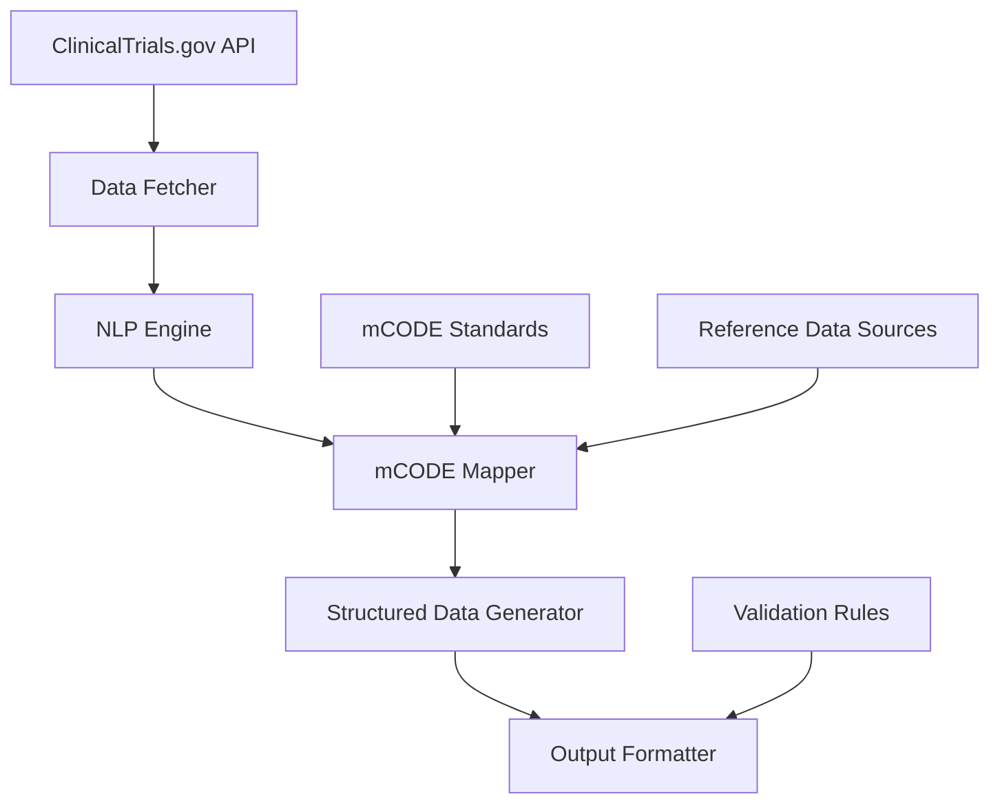

# mCODE Translator System - Comprehensive Summary

## Project Overview
The mCODE Translator is a sophisticated system designed to process clinical trial eligibility criteria from clinicaltrials.gov and translate them into standardized mCODE (Minimal Common Oncology Data Elements) format. This system bridges the gap between unstructured clinical trial criteria and structured, interoperable oncology data.

## System Architecture

**Default NLP Engine**: LLM (deepseek-coder) with fallback to Regex/SpaCy

### Component Diagram

### Core Modules

1. **Data Fetcher**
   - Retrieves clinical trial data from clinicaltrials.gov API
   - Handles rate limiting and pagination
   - Implements caching for performance optimization
   - Extracts eligibility criteria text from records

2. **NLP Engine**
   - **Primary Engine**: LLM (deepseek-coder) for highest accuracy
   - **Fallback Engines**:
     - Regex for fast pattern matching
     - SpaCy with medical models
   - Specialized for breast cancer biomarker extraction (ER/PR/HER2)
   - Processes unstructured text using medical NLP techniques
   - Identifies medical conditions, treatments, procedures
   - Extracts demographic restrictions and lab values
   - Uses medical terminology dictionaries
   - Includes fallback mechanisms for robust operation

4. **mCODE Mapper**
   - Comprehensive mapping to mCODE FHIR standards
   - Specialized breast cancer support:
     - Biomarker mapping (ER/PR/HER2 status)
     - Genomic variants (BRCA1/2, PIK3CA, TP53)
     - Treatment history (chemo, radiation, surgery)
   - Code system support:
     - ICD-10-CM, CPT, LOINC, RxNorm, SNOMED CT
     - Cross-walks between systems (ICD10CM ↔ SNOMEDCT)
   - Advanced features:
     - mCODE compliance validation
     - Demographic mapping (age, gender, race/ethnicity)
     - Structured FHIR resource generation
     - Confidence scoring for mappings

5. **Structured Data Generator**
   - Creates structured mCODE representations
   - Ensures data completeness and consistency
   - Handles relationships between data elements
   - Applies default values where appropriate

6. **Output Formatter**
   - Formats output in various standards (JSON, XML, FHIR)
   - Validates generated mCODE data
   - Provides error reporting and data quality metrics
   - Supports batch processing capabilities

## Key Features

### Data Processing Capabilities
- **Clinical Trial Data Acquisition**: Fetches data from clinicaltrials.gov API
- **Eligibility Criteria Parsing**: Extracts structured information from unstructured text
- **Medical Concept Recognition**: Identifies conditions, treatments, and procedures
- **Patient Characteristic Extraction**: Identifies age, gender, and other demographic restrictions
- **Code Mapping**: Maps concepts to standard medical codes (ICD-10-CM, CPT, LOINC, RxNorm)

### mCODE Generation
- **FHIR Resource Creation**: Generates compliant FHIR resources
- **mCODE Profile Compliance**: Ensures adherence to mCODE Implementation Guide
- **Resource Bundling**: Creates complete patient-trial profiles
- **Quality Assurance**: Validates generated data for accuracy and completeness

### Output Formats
- **FHIR JSON**: Primary output format for interoperability
- **FHIR XML**: Alternative XML representation
- **CSV/Tabular**: Simplified format for analysis
- **Human-Readable Reports**: Summary documents for clinical review

## Technical Implementation

### Technology Stack
- **Primary Language**: Python 3.8+
- **NLP Libraries**: spaCy with medical models
- **API Framework**: RESTful API for integration
- **Data Processing**: JSON and FHIR libraries
- **Validation**: Custom rules engine with terminology services

### Data Flow
1. **Data Acquisition**: Fetch clinical trial data from clinicaltrials.gov API
2. **Preprocessing**: Parse eligibility criteria and extract structured elements
3. **NLP Processing**: Identify medical concepts in unstructured text
4. **Code Mapping**: Map concepts to standard medical codes
5. **mCODE Generation**: Create structured FHIR resources
6. **Validation**: Validate generated data against standards
7. **Output**: Format and deliver results to users

## Validation and Quality Assurance

### Validation Levels
1. **Structural Validation**: FHIR resource structure compliance
2. **Terminology Validation**: Code system and value set membership
3. **Clinical Validation**: Logical consistency and plausibility
4. **mCODE Compliance**: Adherence to mCODE Implementation Guide

### Quality Metrics
- **Extraction Accuracy**: Precision and recall for concept recognition
- **Mapping Quality**: Accuracy of code translations
- **Completeness**: Coverage of required mCODE elements
- **Performance**: Processing time and resource utilization

## Testing Strategy

### Test Categories
1. **Unit Testing**: Individual component validation
2. **Integration Testing**: End-to-end workflow testing
3. **Clinical Trial Testing**: Real-world clinical trial processing
4. **Validation Testing**: mCODE compliance verification

### Sample Clinical Trials
- **Diverse Cancer Types**: Breast, lung, colorectal, and rare cancers
- **Multiple Trial Phases**: Phase I-IV studies
- **Varying Complexity**: Simple to complex eligibility criteria
- **Special Populations**: Pediatric, geriatric, and pregnant patients

## Deployment and Operations

### Installation Requirements
- Python 3.8 or higher
- Internet connectivity for API access
- Sufficient storage for caching and processing
- Access to terminology services (UMLS, LOINC, etc.)

### Configuration Options
- API key management
- Caching settings
- Output format selection
- Validation rule customization

### Monitoring and Maintenance
- Performance metrics tracking
- Error rate monitoring
- Processing time analysis
- Quality score reporting

## Future Enhancements

### Advanced Features
- **Machine Learning Models**: Improved NLP and mapping accuracy
- **Active Learning**: Continuous improvement through feedback
- **Multilingual Support**: Processing of non-English clinical trials
- **Real-time Processing**: Streaming data processing capabilities

### Integration Opportunities
- **EHR Systems**: Direct integration with electronic health records
- **Research Databases**: Connection to clinical research networks
- **Regulatory Submissions**: Support for FDA and other regulatory requirements
- **Data Analytics**: Integration with clinical trial analytics platforms

## Conclusion
The mCODE Translator represents a significant advancement in clinical trial data processing and oncology data standardization. By automatically converting unstructured eligibility criteria into structured mCODE format, this system enables better data interoperability, improved patient matching for clinical trials, and enhanced research capabilities in oncology.

The modular architecture allows for flexible deployment and customization, while comprehensive validation ensures high-quality output that meets clinical and regulatory standards. With continued development and refinement, the mCODE Translator has the potential to become an essential tool in the oncology research ecosystem.

Recent system improvements have enhanced biomarker extraction, added fallback model loading for SpaCy NLP engine, and streamlined debugging scripts.