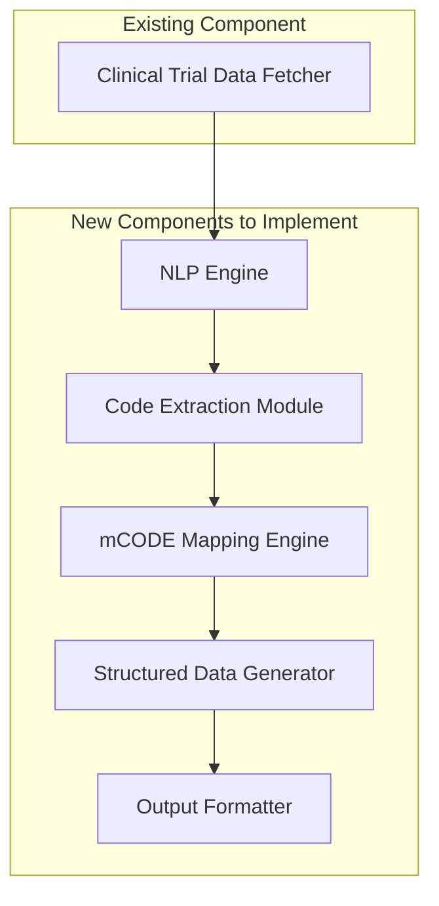

# mCODE Translator Development Plan

## Current System State

The mCODE Translator currently has a working data fetcher that can:
- Search for clinical trials by condition
- Fetch complete study records by NCT ID
- Display results in console or export to JSON
- Cache API responses to reduce calls

However, the system is missing the core processing components that transform clinical trial eligibility criteria into mCODE format.

## Missing Components

Based on the architecture documentation, we need to implement:

### 1. NLP Engine for Criteria Parsing
Responsible for extracting structured information from unstructured eligibility criteria text.

### 2. Code Extraction Module
Identifies and validates medical codes (ICD-10-CM, CPT, LOINC, RxNorm) in the text.

### 3. mCODE Mapping Engine
Maps extracted concepts to mCODE data elements and standard codes.

### 4. Structured Data Generator
Creates FHIR resources in mCODE format from the extracted information.

## Implementation Plan

### Phase 1: NLP Engine Implementation
1. Set up medical NLP libraries (spaCy with medical models)
2. Implement text preprocessing functions
3. Create entity recognition for medical conditions, procedures, demographics
4. Develop criteria classification (inclusion/exclusion)
5. Add confidence scoring for extracted entities

### Phase 2: Code Extraction Module
1. Implement pattern-based recognition for medical codes
2. Add validation functions for code formats and existence
3. Create mapping between different coding systems
4. Develop confidence scoring for code extraction

### Phase 3: mCODE Mapping Engine
1. Implement mapping rules from extracted entities to mCODE elements
2. Create cross-walks between standard codes and mCODE requirements
3. Add validation for mCODE compliance

### Phase 4: Structured Data Generator
1. Implement FHIR resource generation for Patient, Condition, Procedure, etc.
2. Ensure compliance with mCODE FHIR profiles
3. Create resource bundling functionality
4. Add validation for generated resources

### Phase 5: Integration and Testing
1. Integrate all components into the main workflow
2. Create command-line options for processing criteria
3. Implement end-to-end testing
4. Add documentation and examples

## Component Architecture

## Testing Strategy

### Unit Testing
- Test each module independently with sample criteria text
- Validate code extraction patterns
- Verify mCODE mapping accuracy
- Check FHIR resource generation

### Integration Testing
- End-to-end processing of clinical trial criteria
- Validate data flow between components
- Test error handling and edge cases

### Validation Testing
- Verify generated mCODE compliance with FHIR profiles
- Check completeness of extracted information
- Validate against real clinical trial data

## Dependencies

Additional dependencies needed:
- spaCy with medical models (`en_core_sci_md`)
- FHIR client library for resource generation
- Medical terminology libraries (UMLS, LOINC, etc.)

## Timeline

1. NLP Engine: 3-5 days
2. Code Extraction Module: 2-3 days
3. mCODE Mapping Engine: 3-4 days
4. Structured Data Generator: 2-3 days
5. Integration and Testing: 3-4 days

Total estimated development time: 13-18 days