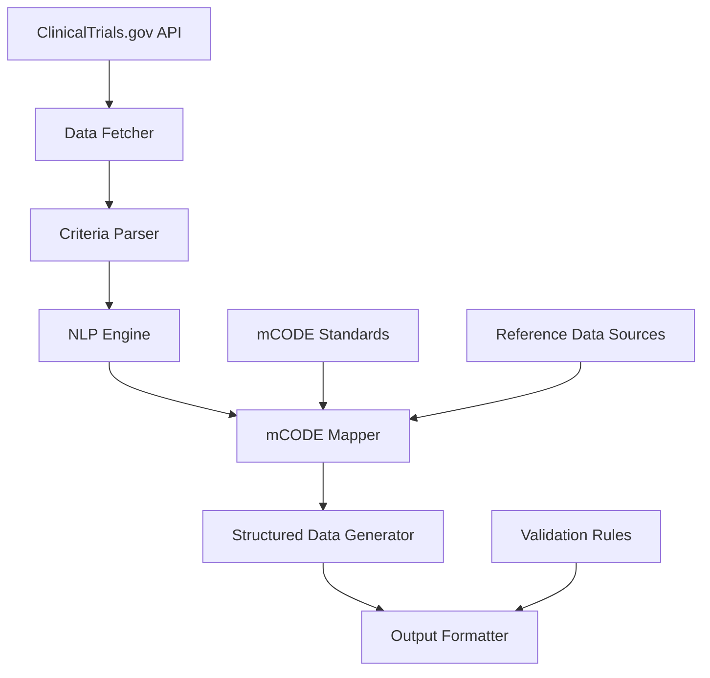

# mCODE Translator System Architecture

## Overview
The mCODE Translator is a system that processes clinical trial criteria from clinicaltrials.gov and translates them into mCODE standard format. The system extracts relevant medical concepts from unstructured eligibility criteria and maps them to standardized mCODE data elements.

## System Architecture Diagram

## Core Components

### 1. Data Fetcher
- Fetches clinical trial data from clinicaltrials.gov API
- Handles API rate limiting and pagination
- Caches data to reduce API calls
- Supports search and filtering capabilities

### 2. Criteria Parser
- Extracts eligibility criteria text from clinical trial records
- Identifies structured elements (age limits, gender restrictions)
- Segregates inclusion and exclusion criteria
- Prepares text for NLP processing

### 3. NLP Engine
- Processes unstructured text using medical NLP techniques
- Identifies medical conditions, treatments, procedures
- Extracts demographic restrictions
- Recognizes lab values and measurements
- Uses medical terminology dictionaries

### 4. mCODE Mapper
- Maps extracted concepts to mCODE data elements
- References ICD-10-CM, CPT, LOINC, RxNorm codes
- Handles code translations and equivalencies
- Applies business rules for mapping decisions

### 5. Structured Data Generator
- Creates structured mCODE representations
- Ensures data completeness and consistency
- Handles relationships between data elements
- Applies default values where appropriate

### 6. Output Formatter
- Formats output in various standards (JSON, XML, FHIR)
- Validates generated mCODE data
- Provides error reporting and data quality metrics
- Supports batch processing capabilities

## Data Flow

1. **Data Acquisition**: System fetches clinical trial data from clinicaltrials.gov API
2. **Preprocessing**: Eligibility criteria are extracted and prepared for analysis
3. **NLP Processing**: Unstructured text is processed to identify medical concepts
4. **Code Mapping**: Identified concepts are mapped to mCODE standard codes
5. **Structure Generation**: mCODE data is structured according to FHIR profiles
6. **Validation**: Generated data is validated against mCODE standards
7. **Output**: Results are formatted and delivered to the user

## Technology Stack

### Backend
- **Language**: Python (for rich NLP libraries) or Node.js (for web integration)
- **NLP Libraries**: spaCy, NLTK, or scikit-learn for medical text processing
- **API Framework**: Flask or Express for REST API endpoints
- **Data Storage**: In-memory cache for temporary storage

### Medical Coding Libraries
- **UMLS Integration**: For medical terminology mapping
- **FHIR Libraries**: For mCODE standard compliance
- **Code Mapping**: Custom mapping tables for ICD-10-CM, CPT, LOINC, RxNorm

### Deployment
- **Containerization**: Docker for consistent deployment
- **Cloud Platform**: AWS/Azure/GCP for scalability
- **API Gateway**: For rate limiting and access control

## Integration Points

### External APIs
- **clinicaltrials.gov API**: Primary data source
- **UMLS API**: Medical terminology services
- **LOINC/Terminology Servers**: Code validation services

### Data Standards
- **FHIR R4**: Primary interoperability standard
- **mCODE Implementation Guide**: Specific implementation rules
- **HL7 v2**: For integration with legacy systems

## Security Considerations

- **Data Privacy**: No patient data is processed, only clinical trial criteria
- **API Keys**: Secure management of clinicaltrials.gov API keys
- **Rate Limiting**: Compliance with API usage limits
- **Audit Logging**: Track data processing activities

## Performance Requirements

- **Response Time**: < 5 seconds for single trial processing
- **Batch Processing**: Support for processing 100+ trials
- **Scalability**: Horizontal scaling for high-volume processing
- **Reliability**: 99.9% uptime for API services