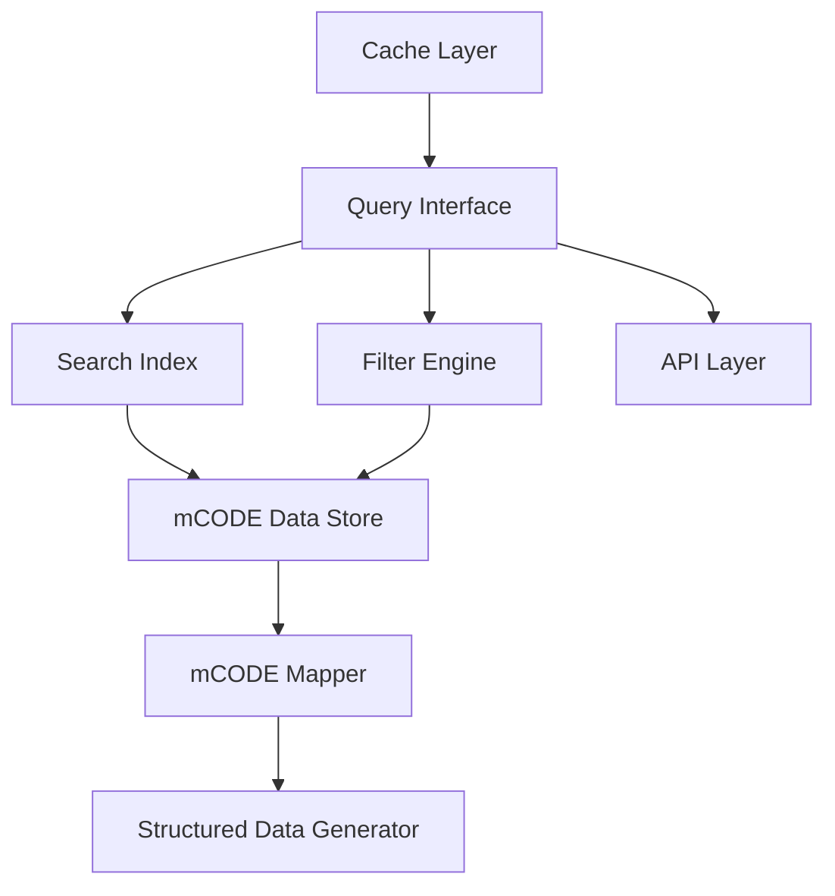

# Query Interface Design

## Overview
The Query Interface provides a flexible and efficient system for searching and filtering translated medical codes within the mCODE Translator system. This document outlines the design of a query system that enables users to search through translated medical codes, apply filters, and retrieve relevant matches.

## System Integration



## Core Components

### 1. Query Parser
- Processes user queries into structured search criteria
- Supports boolean operations (AND, OR, NOT)
- Handles exact matches and fuzzy searching
- Validates query syntax and parameters

### 2. Search Index
- Indexes medical codes by multiple attributes
- Supports full-text search across code descriptions
- Maintains relationships between related codes
- Optimizes for fast retrieval performance

### 3. Filter Engine
- Processes structured filters for:
  - Code types (ICD-10-CM, CPT, LOINC, RxNorm)
  - Categories (conditions, procedures, medications)
  - Status (active, deprecated)
  - Relationships (parent/child codes)

### 4. Cache Layer
- Caches frequently accessed queries
- Maintains result sets for pagination
- Implements LRU (Least Recently Used) eviction
- Configurable cache size and TTL

## API Design

### Query Endpoints

#### Search Endpoint
```
GET /api/v1/codes/search
Parameters:
- query: string (search terms)
- type: string[] (code types)
- category: string[] (categories)
- page: integer
- limit: integer
```

#### Filter Endpoint
```
POST /api/v1/codes/filter
Body:
{
  "filters": {
    "types": string[],
    "categories": string[],
    "status": string[],
    "dateRange": {
      "start": string,
      "end": string
    }
  },
  "pagination": {
    "page": integer,
    "limit": integer
  }
}
```

## Query Language

### Basic Syntax
```
code:"J45.50" AND category:respiratory
type:ICD-10 OR type:SNOMED
description:"asthma*" NOT status:deprecated
```

### Advanced Features
- Wildcard support (*)
- Fuzzy matching (~)
- Range queries (date:[2020 TO 2023])
- Field-specific searches
- Proximity searches

## Performance Considerations

### Indexing Strategy
- Asynchronous index updates
- Incremental indexing for new codes
- Optimized index structure for medical terminology

### Caching Strategy
- Multi-level cache (memory, disk)
- Cache warming for common queries
- Distributed caching for scalability

### Query Optimization
- Query plan optimization
- Result set pagination
- Lazy loading of detailed records

## Error Handling

### Input Validation
- Query syntax validation
- Parameter bounds checking
- Invalid code detection

### Error Responses
- Structured error messages
- Error categorization
- Debugging information (dev mode)

## Security Considerations

- Rate limiting per client
- Query complexity limitations
- Access control integration
- Audit logging of searches

## Monitoring and Metrics

### Key Metrics
- Query response times
- Cache hit rates
- Index update times
- Error rates

### Monitoring Points
- Query performance
- Resource utilization
- Cache effectiveness
- Error patterns