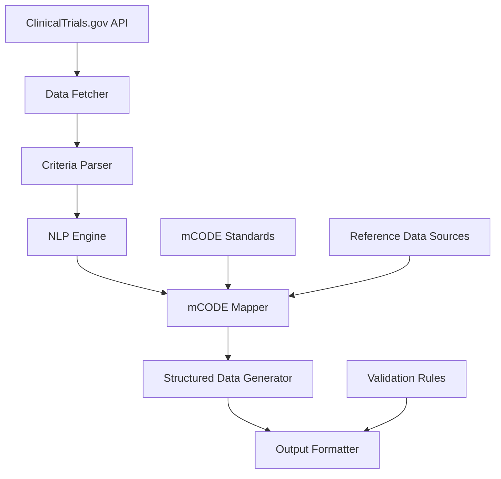

# mCODE Translator System Documentation

## Overview
The mCODE Translator is a system that processes clinical trial eligibility criteria from clinicaltrials.gov and translates them into standardized mCODE (Minimal Common Oncology Data Elements) format. The system extracts relevant medical concepts from unstructured eligibility criteria and maps them to standardized mCODE data elements.

## System Architecture

### High-Level Architecture


### Core Components

#### 1. Data Fetcher
Responsible for retrieving clinical trial data from clinicaltrials.gov API.

**Key Features**:
- API interaction with rate limiting compliance
- Data caching for performance optimization
- Error handling and retry logic
- Support for search and filtering

#### 2. Criteria Parser
Processes raw clinical trial data and extracts eligibility criteria.

**Key Features**:
- Text preprocessing and cleaning
- Section identification (inclusion/exclusion)
- Structured data extraction
- Format standardization

#### 3. NLP Engine
Applies natural language processing to identify medical concepts.

**Key Features**:
- Medical entity recognition
- Temporal expression identification
- Context-aware concept extraction
- Confidence scoring for recognized entities

#### 4. mCODE Mapper
Maps extracted concepts to mCODE standard codes and elements.

**Key Features**:
- Code system mapping (ICD-10-CM, CPT, LOINC, RxNorm)
- mCODE profile compliance
- Cross-system code translation
- Quality assurance validation

#### 5. Structured Data Generator
Creates standardized FHIR resources from mapped elements.

**Key Features**:
- FHIR resource generation
- mCODE profile adherence
- Resource relationship management
- Bundle creation for complete datasets

#### 6. Output Formatter
Formats and validates generated mCODE data for output.

**Key Features**:
- Multiple format support (JSON, XML, CSV)
- Data validation and quality checks
- Error reporting and logging
- Export functionality

## Installation and Setup

### Prerequisites
- Python 3.8 or higher
- pip package manager
- Access to clinicaltrials.gov API
- Internet connectivity

### Installation Steps
1. Clone the repository:
   ```bash
   git clone https://github.com/your-organization/mcode-translator.git
   cd mcode-translator
   ```

2. Create a virtual environment:
   ```bash
   python -m venv venv
   source venv/bin/activate  # On Windows: venv\Scripts\activate
   ```

3. Install dependencies:
   ```bash
   pip install -r requirements.txt
   ```

4. Configure environment variables:
   ```bash
   export CLINICALTRIALS_API_KEY=your_api_key_here
   export CACHE_DIR=./cache
   ```

### Configuration
Create a `config.json` file in the project root:
```json
{
  "api_base_url": "https://clinicaltrials.gov/api/query",
  "cache_enabled": true,
  "cache_dir": "./cache",
  "rate_limit_delay": 1,
  "request_timeout": 30,
  "output_format": "json"
}
```

## Usage Guide

### Command Line Interface
The mCODE Translator provides a command-line interface for processing clinical trials:

```bash
# Process a single clinical trial by NCT ID
python mcode_translator.py --nct-id NCT00000001

# Process multiple trials by condition
python mcode_translator.py --condition "breast cancer" --limit 10

# Export results to file
python mcode_translator.py --nct-id NCT00000001 --export results.json

# Validate existing mCODE data
python mcode_translator.py --validate input_data.json
```

### Programmatic Usage
The system can also be used programmatically:

```python
from mcode_translator import MCodeTranslator

# Initialize the translator
translator = MCodeTranslator()

# Process a clinical trial
result = translator.process_trial("NCT00000001")

# Export results
translator.export_results(result, "output.json")
```

### API Usage
For integration with other systems, the translator provides a REST API:

```bash
# Start the API server
python api_server.py

# Process a trial via API
curl -X POST http://localhost:8000/process \
  -H "Content-Type: application/json" \
  -d '{"nct_id": "NCT00000001"}'
```

## Data Processing Workflow

### Step 1: Data Acquisition
The system fetches clinical trial data from clinicaltrials.gov API using the study_fields endpoint.

### Step 2: Criteria Parsing
Eligibility criteria text is parsed to identify:
- Inclusion and exclusion sections
- Age and gender restrictions
- Medical condition references
- Treatment history requirements

### Step 3: NLP Processing
Medical concepts are extracted using:
- Named Entity Recognition for medical terms
- Pattern matching for structured elements
- Context analysis for disambiguation
- Confidence scoring for quality assessment

### Step 4: Code Mapping
Identified concepts are mapped to:
- ICD-10-CM codes for conditions
- CPT codes for procedures
- LOINC codes for laboratory tests
- RxNorm codes for medications

### Step 5: mCODE Generation
Standardized FHIR resources are created:
- Patient resources for demographics
- Condition resources for medical conditions
- Procedure resources for treatments
- Observation resources for lab values

### Step 6: Validation and Output
Generated data is validated against:
- FHIR resource profiles
- mCODE Implementation Guide requirements
- Clinical plausibility rules
- Data quality metrics

## Output Formats

### FHIR JSON
The primary output format following HL7 FHIR R4 and mCODE Implementation Guide:

```json
{
  "resourceType": "Bundle",
  "type": "collection",
  "entry": [
    {
      "resource": {
        "resourceType": "Patient",
        "gender": "female",
        "birthDate": "1950-01-01"
      }
    }
  ]
}
```

### CSV Format
Simplified tabular format for easy analysis:

```csv
NCTId,PatientGender,MinAge,MaxAge,ConditionCode,ConditionSystem
NCT00000001,female,18,75,C50.911,ICD-10-CM
```

### Human-Readable Report
Summary format for clinical review:

```markdown
# Clinical Trial mCODE Analysis: NCT00000001

## Patient Eligibility Criteria
- Gender: Female only
- Age: 18-75 years
- Conditions: Breast Cancer (C50.911)
```

## Error Handling

### Common Errors
1. **API Rate Limiting**: System implements automatic backoff
2. **Invalid NCT IDs**: Returns appropriate error messages
3. **Processing Failures**: Logs detailed error information
4. **Validation Errors**: Provides specific validation feedback

### Error Response Format
```json
{
  "error": {
    "code": "VALIDATION_ERROR",
    "message": "Invalid date format in Patient resource",
    "details": {
      "resource": "Patient",
      "field": "birthDate"
    }
  }
}
```

## Performance Considerations

### Processing Time
- Single trial: 1-5 seconds
- Batch processing: 100+ trials per hour
- Large datasets: Optimized streaming processing

### Memory Usage
- Single trial: < 50MB
- Batch processing: Configurable memory limits
- Caching: Efficient memory management

### Scalability
- Horizontal scaling support
- Load balancing capabilities
- Cloud deployment ready

## Troubleshooting

### Common Issues

#### API Access Problems
- Verify internet connectivity
- Check API key validity
- Confirm rate limit compliance

#### Processing Failures
- Check input data format
- Verify sufficient memory available
- Review error logs for details

#### Validation Errors
- Ensure mCODE profile compliance
- Check code system validity
- Validate clinical plausibility

### Support Resources
- GitHub issues: https://github.com/your-organization/mcode-translator/issues
- Documentation: https://your-organization.github.io/mcode-translator
- Contact: support@your-organization.org

## Contributing

### Development Setup
1. Fork the repository
2. Create a feature branch
3. Implement changes
4. Add tests
5. Submit pull request

### Code Style
- Follow PEP 8 guidelines
- Use type hints for function parameters
- Include docstrings for all functions
- Write unit tests for new functionality

### Testing
- Run unit tests: `python -m pytest tests/`
- Run integration tests: `python -m pytest tests/integration/`
- Check code coverage: `python -m pytest --cov=src/ tests/`

## License
This project is licensed under the Apache 2.0 License - see the LICENSE file for details.

## Acknowledgments
- National Cancer Institute for mCODE initiative
- clinicaltrials.gov for API access
- HL7 FHIR community for standards development